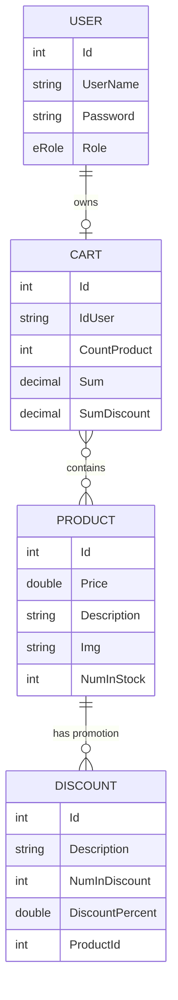

 # 🛒 ShoppingCart

A smart shopping cart application with product search, quantity-based discounts, and a digital receipt at checkout. Managers maintain products, stock, and promotions from an admin dashboard.


## Features

**Customers**
- Search products by description or scan a code
- Add products to a personal cart and change quantities
- Automatic promotions: buy N items and get a percentage off
- Checkout with a digital receipt showing subtotal, savings, and total

**Managers**
- Admin dashboard with product and promotion counts
- Add products and update stock
- Create and edit promotions

**Platform**
- JWT authentication with `manager` and `customer` roles
- Layered .NET architecture (Core, Data, Service, API)
- Swagger UI for exploring the API

## How Discounts Work

A promotion is defined per product with a **quantity threshold** and a **percentage**. For every full group of items in the cart, the discount applies to that group.

| Field | Meaning |
|---|---|
| `numInDiscount` | Items needed to trigger the promotion |
| `discountPercent` | Percentage taken off those items |

Example: 10% off for every 3 items. Buying 7 items discounts 6 of them (2 groups of 3).

## Tech Stack

| | |
|---|---|
| **Server** | ASP.NET Core 8 Web API, Entity Framework Core 8, SQL Server, AutoMapper, JWT Bearer, Swagger, xUnit |
| **Client** | React 18, TypeScript, Vite, Tailwind CSS, shadcn/ui, React Router, TanStack Query, Framer Motion. Built with [Lovable](https://lovable.dev) |

## Getting Started

**Requirements:** .NET 8 SDK, SQL Server LocalDB (included with Visual Studio), Node.js 18+

```bash
git clone https://github.com/t0556746399-a11y/ShoppingCart.git
cd ShoppingCart
```

### 1. Server

```bash
cd server-shoppingCart-Netcore
dotnet ef database update --project ShoppingCart.Data --startup-project ShoppingCart
dotnet run --project ShoppingCart
```

The API runs on `https://localhost:7222` and `http://localhost:5090`. Swagger UI is available at `/swagger`.

Set your own values in `ShoppingCart/appsettings.json`:

```json
{
  "ConnectionStrings": {
    "DefaultConnection": "Server=(localdb)\\mssqllocaldb;Database=ShoppingCart;Trusted_Connection=True;MultipleActiveResultSets=true"
  },
  "Jwt": {
    "Issuer": "https://localhost:7222",
    "Audience": "https://localhost:8080",
    "Key": "<a long random secret, at least 32 characters>"
  }
}
```

### 2. Client

```bash
cd client-shoppingCart-react
npm install
npm run dev
```

Open `http://localhost:8080`. The server's CORS policy allows this origin.

Parts of the admin area use Supabase. Create a `.env` file in the client folder and run `supabase-schema.sql` in your Supabase project:

```env
VITE_SUPABASE_URL=https://your-project.supabase.co
VITE_SUPABASE_ANON_KEY=your_anon_key
```

### Tests

```bash
cd server-shoppingCart-Netcore
dotnet test
```

## Roles

| Role | Access |
|---|---|
| Anonymous | Browse products and promotions |
| `customer` | Personal cart and checkout |
| `manager` | Add products, create and edit promotions, admin dashboard |

## API

Base URL: `https://localhost:7222/api`. Protected endpoints require `Authorization: Bearer <token>`.

| Resource | Endpoints |
|---|---|
| **Auth** | `POST /Auth/login` |
| **Product** | `GET /Product` · `GET /Product/desc/{description}` · `POST /Product` (manager) · `PUT /Product/{id}/count` |
| **Discount** | `GET /Discount` · `GET /Discount/{id}` · `POST /Discount` (manager) · `PUT /Discount/{id}` (manager) |
| **Cart** | `GET /Cart` · `DELETE /Cart/{id}` · `PUT /Cart/{cartId}/product/{productId}` · `DELETE /Cart/{cartId}/product/{productId}` (all require login) |

## Data Model



## Project Structure

```text
ShoppingCart/
├── server-shoppingCart-Netcore/
│   ├── ShoppingCart/            # API: controllers, models, Program.cs
│   ├── ShoppingCart.Core/       # Entities, DTOs, interfaces
│   ├── ShoppingCart.Data/       # DbContext, repositories, migrations
│   ├── ShoppingCart.Service/    # Business logic
│   └── ShoppingCartTest/        # xUnit tests
└── client-shoppingCart-react/
    ├── src/pages/               # Index, AdminDashboard
    ├── src/components/          # Cart, checkout, scanner, admin modals, UI kit
    ├── src/context/             # Cart and auth state
    └── src/services/            # API clients
```
